# 📚 Library Management System

A web-based **Library Management System** built with **ASP.NET Core MVC**, **Entity Framework Core**, **ASP.NET Core Identity**, and **SQL Server**.

## 📸 Screenshots

### Dashboard

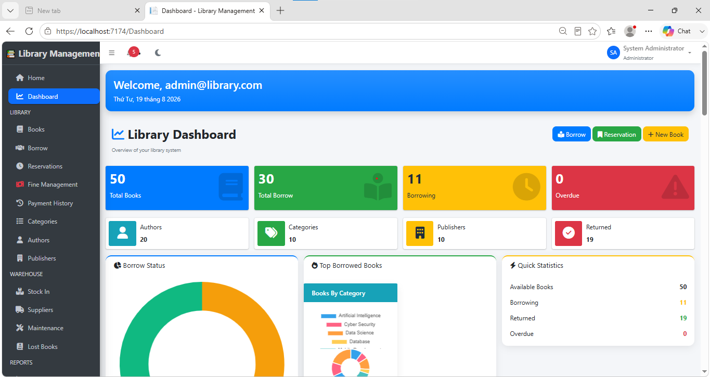

### Book Management

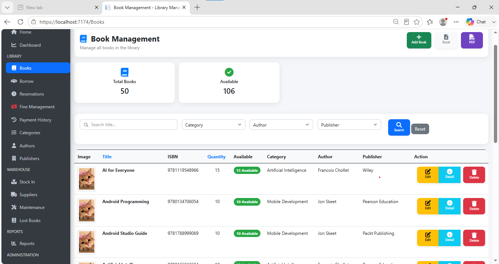

### Borrow & Return

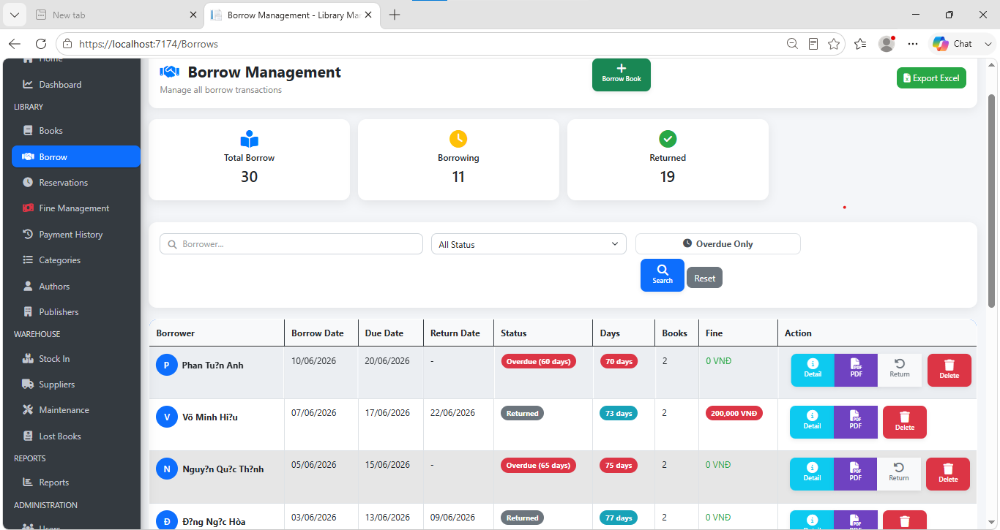

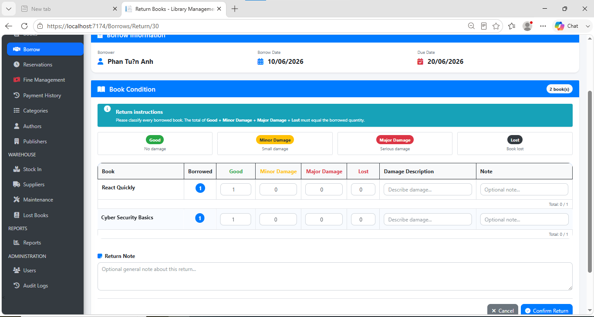

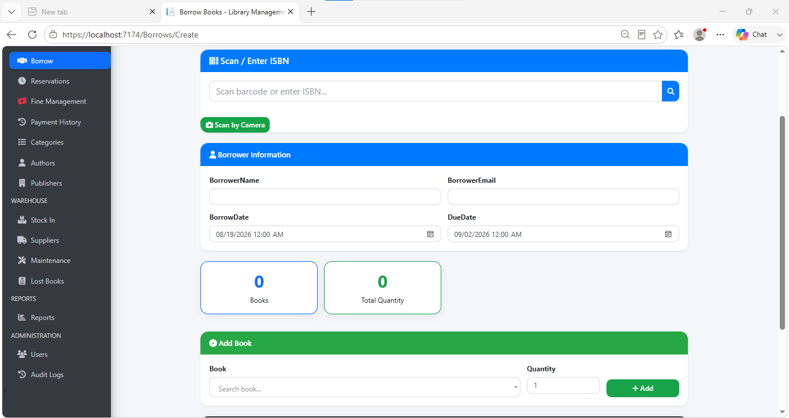

### Stock In

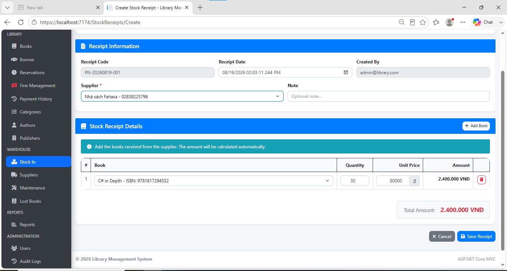

### Supplier Management

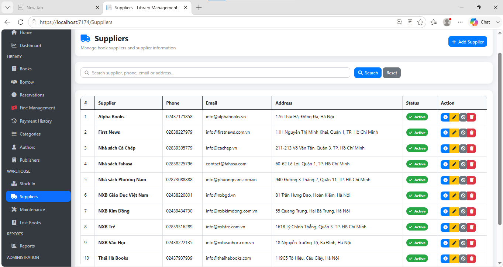

### Maintenance

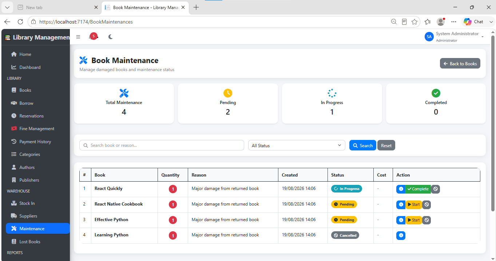

### Reservation


### Report

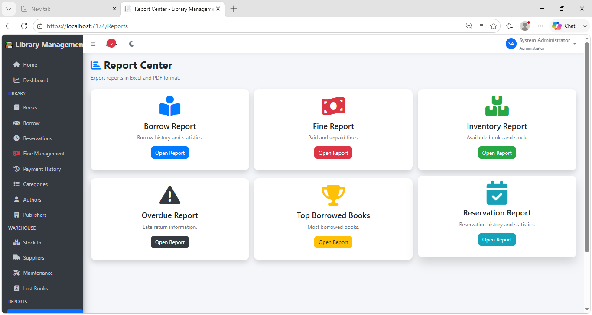

### Fine Management and payment

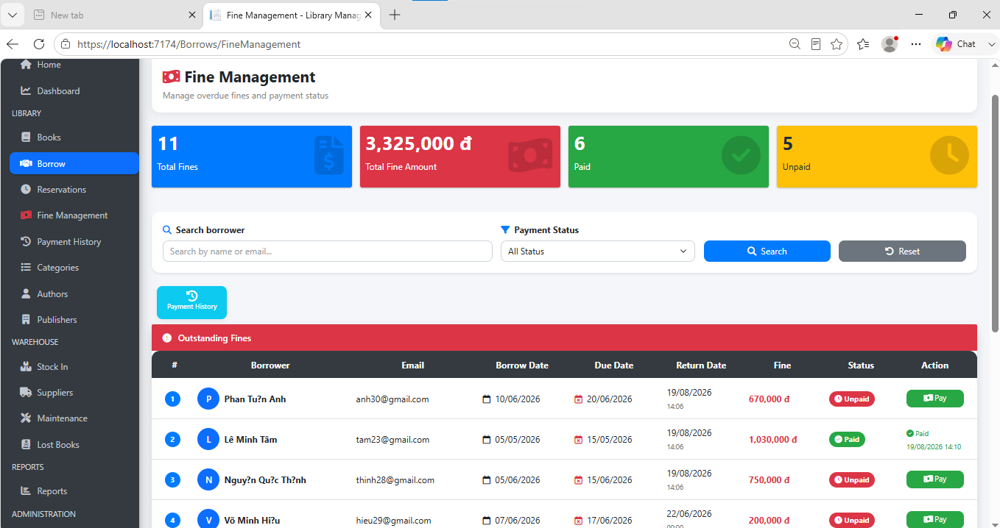

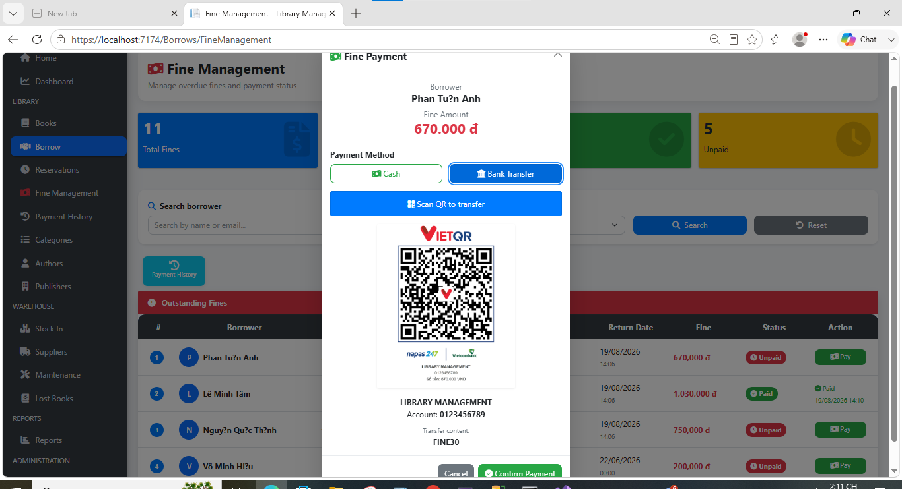

### User

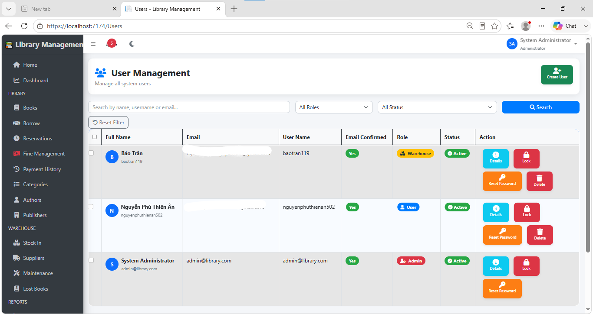

### AuditLog

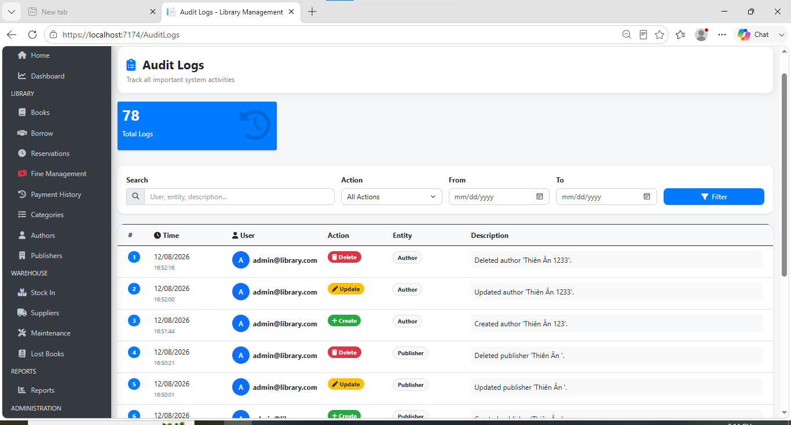


## ✨ Features

### 📚 Book Management

* Manage books
* Manage categories
* Manage authors
* Manage publishers
* Track total quantity
* Track available quantity
* Search and filter books

### 🤝 Borrow & Return

* Create borrowing records
* Return books
* Track borrowing status
* View current borrowers
* View borrowing history
* Calculate overdue fines
* Manage fine payments
* View payment history

### 📦 Warehouse Management

#### Stock In

* Create stock receipts
* Generate receipt codes
* Select suppliers
* Add multiple books
* Enter quantity and unit price
* Calculate item amount
* Calculate total import value
* Automatically update book inventory
* Edit stock receipts
* Delete stock receipts
* Export stock receipt invoices to PDF
* Search and pagination

#### Suppliers

* Create suppliers
* Edit suppliers
* View supplier details
* Delete suppliers
* Search suppliers
* Pagination

#### Maintenance

* Record damaged books
* Record maintenance quantity
* Record maintenance reason
* Start maintenance
* Complete maintenance
* Record maintenance cost
* Cancel maintenance
* Track maintenance status

Maintenance statuses:

* `Pending`
* `In Progress`
* `Completed`
* `Cancelled`

#### Lost Books

* Record lost books
* Track lost book quantity
* Manage lost book information
* Update inventory when books are lost

---

## 👥 User Roles

The system contains three roles:

| Role          | Description                        |
| ------------- | ---------------------------------- |
| **Admin**     | Full system access                 |
| **User**      | Normal library operations          |
| **Warehouse** | Inventory and warehouse operations |

### Admin

Admin can access all modules:

* Dashboard
* Reports
* Books
* Borrow
* Reservations
* Fine Management
* Payment History
* Categories
* Authors
* Publishers
* Stock In
* Suppliers
* Maintenance
* Lost Books
* Users
* Audit Logs

### User

User can access:

* Books
* Borrow
* Reservations
* Fine Management
* Payment History

### Warehouse

Warehouse can access:

* Stock In
* Suppliers
* Maintenance
* Lost Books
* Reports

---

## 📊 Dashboard & Reports

The system provides dashboard and reporting functionality for monitoring library operations, inventory, and borrowing activities.

---

## 👤 User Management

Administrators can:

* Create users
* Edit users
* Delete users
* Assign roles
* Manage user information

Available roles:

```text
Admin
User
Warehouse
```

---

## 🔐 Authentication & Authorization

The application uses **ASP.NET Core Identity** for authentication and role-based authorization.

Example:

```csharp
[Authorize(Roles = "Admin,Warehouse")]
public class StockReceiptsController : Controller
{
}
```

This prevents unauthorized users from accessing warehouse functionality even if they manually enter the URL.

---

## 📝 Audit Logs

Administrators can view system activity through the Audit Logs module.

---

## 🗄️ Database

The project uses **SQL Server** with **Entity Framework Core**.

Main entities include:

* Users
* Books
* Authors
* Categories
* Publishers
* Borrows
* Borrow Details
* Suppliers
* Stock Receipts
* Stock Receipt Details
* Book Maintenance
* Lost Books
* Reservations
* Fines
* Payments
* Audit Logs

---

## 🛠️ Tech Stack

### Backend

* C#
* ASP.NET Core MVC
* Entity Framework Core
* ASP.NET Core Identity

### Frontend

* Razor
* HTML5
* CSS3
* Bootstrap
* JavaScript
* Font Awesome
* SweetAlert

### Database

* Microsoft SQL Server

### Other

* X.PagedList
* PDF invoice generation

---

## 📁 Project Structure

```text
LibraryManagement/
│
├── Controllers/
│   ├── BooksController.cs
│   ├── BorrowsController.cs
│   ├── BookMaintenancesController.cs
│   ├── LostBooksController.cs
│   ├── StockReceiptsController.cs
│   ├── SuppliersController.cs
│   ├── ReportsController.cs
│   ├── UsersController.cs
│   ├── AuditLogsController.cs
│   └── ...
│
├── Data/
│   ├── ApplicationDbContext.cs
│   └── DbInitializer.cs
│
├── Models/
│   ├── Book.cs
│   ├── Borrow.cs
│   ├── BorrowDetail.cs
│   ├── Supplier.cs
│   ├── StockReceipt.cs
│   ├── StockReceiptDetail.cs
│   ├── BookMaintenance.cs
│   ├── LostBook.cs
│   └── ...
│
├── ViewModels/
│   ├── CreateUserViewModel.cs
│   ├── StockReceiptCreateVM.cs
│   └── ...
│
├── Views/
│   ├── Books/
│   ├── Borrows/
│   ├── BookMaintenances/
│   ├── LostBooks/
│   ├── StockReceipts/
│   ├── Suppliers/
│   ├── Users/
│   └── ...
│
├── wwwroot/
│   ├── css/
│   ├── js/
│   └── images/
│
├── Program.cs
└── appsettings.json
```

---

## ⚙️ Installation

### 1. Clone the repository

```bash
git clone <your-repository-url>
```

### 2. Open the project

Open the project using Visual Studio, Visual Studio Code, or JetBrains Rider.

### 3. Configure the database

Open:

```text
appsettings.json
```

Configure the SQL Server connection string:

```json
{
  "ConnectionStrings": {
    "DefaultConnection": "Server=YOUR_SERVER;Database=LibraryManagement;Trusted_Connection=True;TrustServerCertificate=True;"
  }
}
```

Replace `YOUR_SERVER` with your SQL Server instance.

### 4. Apply migrations

Using Package Manager Console:

```powershell
Update-Database
```

Or:

```bash
dotnet ef database update
```

### 5. Run the application

```bash
dotnet run
```

Or run the project directly from Visual Studio.

---

## 👑 Default Admin Account

The application creates a default administrator through `DbInitializer`.

```text
Email: admin@library.com
Password: Admin@123
```

> Change the default password before using the application in production.

---

## 🌱 Database Seeding

`DbInitializer` automatically creates the required roles:

```text
Admin
User
Warehouse
```

It also creates the default administrator account.

Initial development book data can also be seeded through:

```csharp
DbInitializer.SeedBooks(context);
```

---

## 📄 Stock Receipt Workflow

```text
Supplier
    ↓
Create Stock Receipt
    ↓
Add Books
    ↓
Enter Quantity & Unit Price
    ↓
Calculate Amount
    ↓
Calculate Total Import Value
    ↓
Update Book Inventory
    ↓
Save Receipt
    ↓
View Details
    ↓
Export PDF Invoice
```

Each receipt contains:

* Receipt Code
* Receipt Date
* Supplier
* Created By
* Books
* Quantity
* Unit Price
* Amount
* Total Import Value
* Note

---

## 🔧 Maintenance Workflow

```text
Pending
    ↓
Start Maintenance
    ↓
In Progress
    ↓
Complete
    ↓
Completed
```

Maintenance can also be cancelled while it is still pending or in progress.

---

## 📦 Inventory Management

The system tracks:

```text
Quantity
AvailableQuantity
```

`Quantity` represents the total number of copies owned by the library.

`AvailableQuantity` represents the number of copies currently available for borrowing.

Inventory is updated when:

* Books are imported
* Books are borrowed
* Books are returned
* Books enter maintenance
* Books complete maintenance
* Books are reported as lost

---

## 🔎 Search & Pagination

The system supports search, filtering, and pagination for management pages.

Pagination is implemented using:

```text
X.PagedList
```

---

## 🧾 PDF Invoice

Stock receipts can be exported as PDF invoices containing:

* Library information
* Receipt code
* Receipt date
* Supplier
* Book information
* Quantity
* Unit price
* Amount
* Total import value
* Created by

---

## 🚀 Future Improvements

Possible improvements:

* Barcode scanning
* Low-stock notifications
* Email notifications
* Excel export
* Advanced inventory reports
* Supplier purchase history
* Inventory transaction history
* More detailed dashboard statistics
* Improved mobile responsiveness

---

## 🎯 Project Objective

The goal of this project is to provide a centralized system for managing library operations, including:

* Book management
* Borrowing and returning
* Inventory management
* Supplier management
* Stock receiving
* Book maintenance
* Lost books
* Fine management
* User management
* Reports
* Audit logs

The system also demonstrates **role-based access control** by separating normal library operations, warehouse operations, and system administration.

---

## 👨‍💻 Author

**Library Management System**

Built with:

```text
ASP.NET Core MVC
Entity Framework Core
ASP.NET Core Identity
SQL Server
Bootstrap
JavaScript
```
